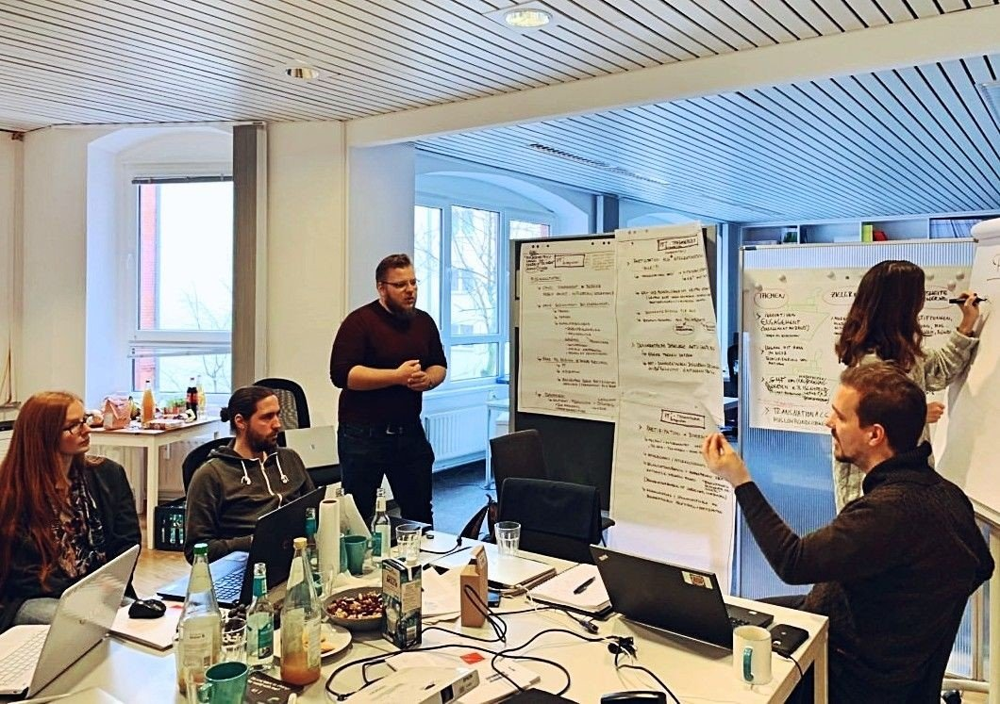
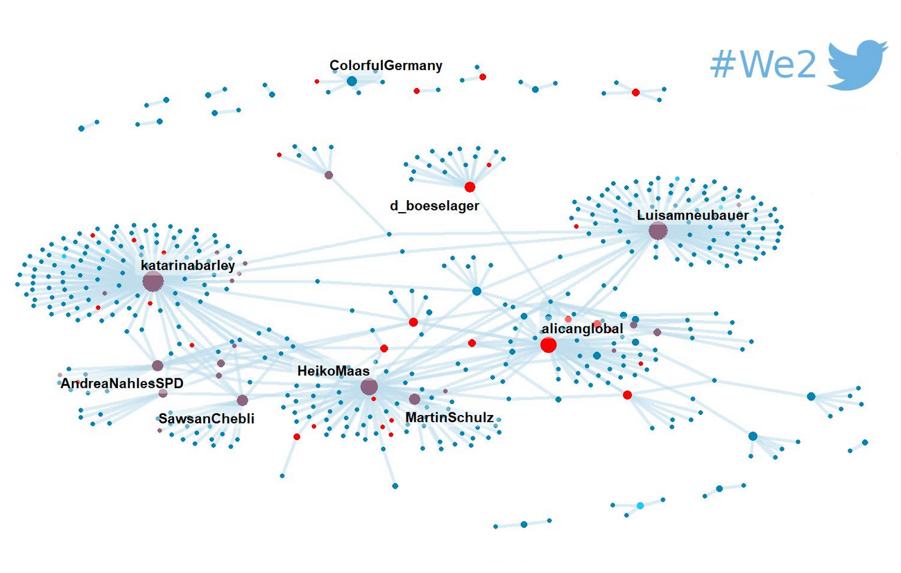

```{r setup, include=FALSE}
options(htmltools.dir.version = FALSE)
```

```{r fontawesome, include=FALSE} 
library(fontawesome)
```

```{r xaringan-themer, include=FALSE}
library(xaringanthemer)
mono_light(base_color = "#2c3e50", 
           header_font_google = google_font("Montserrat", "600"), 
           text_font_google   = google_font("Montserrat", "300", "300i"))
```

class: inverse, center, middle

# CorrelAid e.V.

---

## CorrelAid e.V.

.pull-left[
- **Skilled volunteering:** Data science projects with social organisations

- **Plattform:** A network of 850 data scientists for learning, exchanging ideas and growing together

- **Dialogue:** Bridge the gap between data science and non-profit sector
]

.pull-right[

]

---
class: inverse, center, middle

# Using R for social good

---

## Use Case

.pull-left[
- **Context:** Minor is a German research institution who offers legal
advisory for marginalised groups

- **Objective:** Help volunteers monitor Facebook groups organised by expats and give better guidance if needed

- **Approach:** Build an app to classify and filter multilingual Facebook comments, including English, Bulgarian, and Arabic
]

.pull-right[

]

.center[
***Project team*** <br> Christian Moreau (lead), ..., ...
]

---

## Topic modeling

```{r, fig.align="center", echo=FALSE}

```

---

## Topic modeling (Polish)

```{r, fig.align="center", echo=FALSE}

```

---

## Sentiment analysis

```{r, fig.align="center", echo=FALSE}

```

---

## Impact 💥

- **Minor:** Making better use of volunteers

- **Policymakers:** Tracking issues of importance and making evidence-based decisions

- **Data scientists:** Dealing with real-world data and challenges faced by NPO organisations

---
class: center, middle

# Thanks!

Slides made with `r fa("heart", fill = "#2c3e50e")` and R [*xaringan*](https://github.com/yihui/xaringan).

<br>

**Say hello...** </b>
`r fa("home", fill = "#2c3e50e")` correlaid.org `r fa("twitter", fill = "#2c3e50e")` @CorrelAid `r fa("facebook", fill = "#2c3e50e")` WeAreCorrelAid